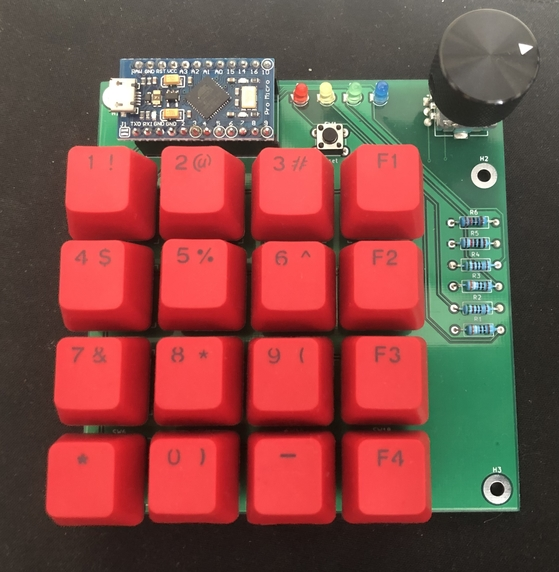
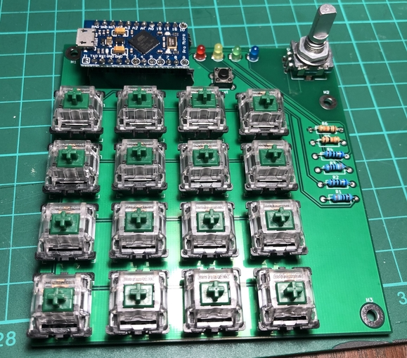

# MacroPagePad
<b>A simple Arduino based HID keypad with up to 60 individual button functions and a rotary encoder </b>

## About

This keypad allows up to 60 individual button-based functions. The MPP has 4 'pages'. The current page is represented by the LED that is lit at the top. Pressing the bottom right page allows you to move to the next page. Each page can allocate a different function for a button. For example, button number 1 at the top left may have the function to stop media playback. Switching to page 2, the same button can be used to take a screenshot etc. This can be really useful when using a program such as photoshop to have specific keyboard shortcuts mapped to buttons on one page and a different set of shortcuts can be mapped for Kicad on a second page. Each page has 15 available buttons to program meaning up to 60 separate functions! The rotary encoder can also be used the same way by changing its behaviour depending on the page.  

## Hardware

The <i>HID_KEYPAD</i> folder contains all the neccesary files to view the PCB schematic and layout within Kicad as well as gerber files. 

This project is based on the Arduino Pro Micro. Modifications will need to be made to the PCB to accomodate the wider Arduino Pro Mini. By using female header pins, you can replace the Arduino Pro micro by just lifting it out of the socket. This PCB uses all THT components. Note, the mounting holes are plated and connected to ground. Be careful not to short any pins on the back of the PCB by resting it on a metal surface while powered on. The soldered PCB should look like this. For reference, this is using Gateron green switches:

The switches are based on the Cherry MX profile and are compitible with a variety of switches such as Gateron. The switches are arranged in a 4x4 matrix config similar to membrane switch matrices. Footprints are included for other brands in the <i>keyswitches.pretty-master</i> folder if you want to replace the footprints.
 
## Software

Use <i>MacroPagePad.ino</i> with the neccesary libraries installed in the arduino IDE. The <i>readKp4x4()</i> is used to determine the button functions. Aside from media controls and keyboard shortcuts, the buttons can't do much on their own. However, using a program such as [AutoHotKey](https://www.autohotkey.com/) makes the MacroPagePad very useful for Windows. This allows you to open and close apps, autofill forms, controlling mouse movements and much more. Simply create a script that is triggered by a random shortcut that isn't used by any other program and create the same shortcut in the .ino file. A good set of shortcuts are simply F13-F24 keys. The keys exist in Windows, Mac and Linux but aren't found on most keyboards. Because of this, these keys aren't really used as shortcuts in a lot of programs so can be used with AutoHotKey or similar. Linux also has tools to set up custom shortcuts. [Hammerspoon](http://www.hammerspoon.org/) is a tool available for MacOS with similar functionality of AHK. 

The rotary controller is setup to control the system volume but can be remapped to zoom, scroll, increase brightness etc. This can also be done with multiple pages. The encoder also has a push button currently mapped to mute/unmute. 

## Troubleshooting/Issues

Be sure to flag any issues or feature requests through Github. This project is open to contribution via pull requests.  

## Credits

The following libraries have been used to make this project possible:

https://github.com/Chris--A/Keypad

https://github.com/BennehBoy/clickEncoder

https://github.com/PaulStoffregen/TimerOne

https://github.com/NicoHood/HID
